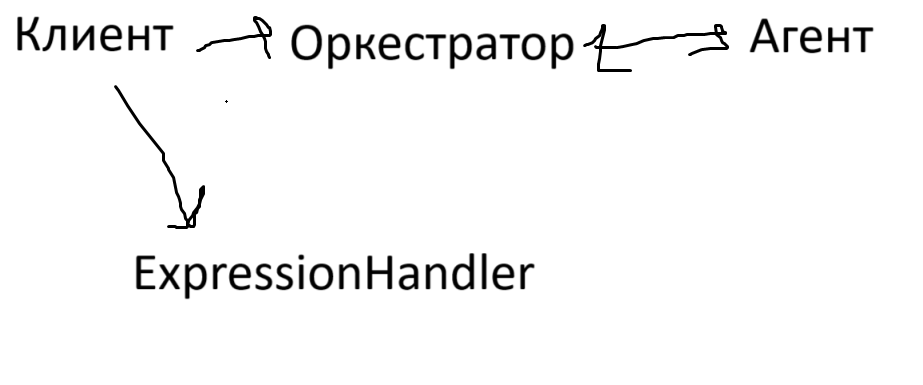

# Калькулятор на Golang'e
Принимает строки и обрабатывает их
### Запуск
```cmd
git clone https://github.com/maxpawgdbs/yandex-go
cd yandex-go
go mod tidy
go run main/main.go
```
##### Приложение поддерживает post запросы с json формата {"expression": "ваше выражение"}
### Пример работы
```bash
curl --location http://localhost:8080/api/v1/calculate --header 'Content-Type: application/json' --data '{"expression": "2+2*2"}'
{"id": <id>}
curl --location http://localhost:8080/api/v1/expressions/<id>
{"id": <id>, "status": "ok", "result": 6}
```
## Структура




